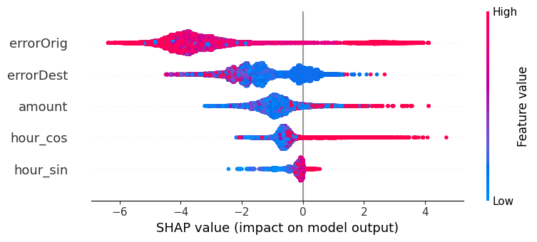

# 🛡️ Fraud Detection

This machine learning project detects **fraudulent mobile money transactions** using a **classification model** and explains its decisions using **SHAP**. We also analyze **hourly patterns in fraud occurrences** to extract real-world insights.

---

## 📦 About the Dataset: PaySim

**PaySim** is a synthetic dataset that simulates **real mobile money transactions**, inspired by services like **M-Pesa** in Kenya. It was **generated using actual transaction patterns** to train and evaluate fraud detection models — **without exposing private user data**.

📄 **Dataset Source**:  
➡️ [PaySim Dataset on Kaggle](https://www.kaggle.com/datasets/ealaxi/paysim1)

PaySim is commonly used for:
- Financial fraud detection
- Transaction modeling
- Machine learning education and benchmarking

---

### 🔍 Dataset Columns Explained

| Column Name       | Description |
|-------------------|-------------|
| `step`            | Time step (1 step = 1 hour) |
| `type`            | Type of transaction (`TRANSFER`, `CASH_OUT`, etc.) |
| `amount`          | Amount transferred in the transaction |
| `nameOrig`        | Unique ID of sender |
| `oldbalanceOrg`   | Sender's balance before the transaction |
| `newbalanceOrig`  | Sender's balance after the transaction |
| `nameDest`        | Unique ID of recipient |
| `oldbalanceDest`  | Recipient's balance before the transaction |
| `newbalanceDest`  | Recipient's balance after the transaction |
| `isFraud`         | `1` if transaction is fraudulent, else `0` |
| `isFlaggedFraud`  | `1` if transaction was flagged by an internal rule (amount > 200k), else `0` |

🧠 **Important Note**:  
Fraud cases are very rare in the dataset (~0.1% of total) — making it ideal to test how well machine learning can identify small but dangerous patterns.

---

## ⚙️ Methodology

1. Loaded the original dataset (~6M rows) and randomly sampled **200,000 transactions** for efficiency  
2. Filtered to include only `TRANSFER` and `CASH_OUT` transaction types, which account for nearly all fraudulent activity  
3. Performed **feature engineering**:
   - `errorOrig` = difference between sender's old and new balance  
   - `errorDest` = mismatch in recipient balances  
   - Encoded `step` (hour) using `sin()` and `cos()` to capture time-of-day patterns (`hour_sin`, `hour_cos`)  
4. Trained an **XGBoostClassifier** on these enriched features  
5. **Tuned the decision threshold** from 0.5 to 0.8 to improve precision and F1-score for the minority fraud class  
6. Applied **SHAP (SHapley Additive exPlanations)** to interpret model decisions  
7. Visualized **hourly fraud frequency** to identify suspicious transaction times  

---

## 🧠 Model Details

- Model: `XGBoostClassifier`
- Dataset size: 200,000 (downsampled)
- Target: `isFraud` column
- Key features: `amount`, `errorOrig`, `errorDest`, `hour_sin`, `hour_cos`
- Custom decision threshold: **0.8**

---

## 📊 Results (Threshold = 0.8)

| Metric               | Value      |
|----------------------|------------|
| Accuracy             | **1.00**   |
| Precision (Fraud)    | **0.30**   |
| Recall (Fraud)       | **0.76**   |
| F1-Score (Fraud)     | **0.43**   |
| ROC AUC Score        | **0.997** ✅ |

> ✅ Despite a highly imbalanced dataset, the model performs strongly — correctly identifying ~76% of frauds with excellent overall discrimination (ROC AUC ≈ 0.997). The high ROC AUC of 0.997 is due to the structured, synthetic nature of the PaySim dataset and the strong fraud patterns captured in key features like amount, balance errors, and transaction timing.

---

## 📈 Visual Results

### 🔹 SHAP Summary Plot

This plot shows **which features influence the fraud prediction the most**.  
Higher SHAP value = stronger impact on classification.

**Insights**:
- Large `amount` values increase likelihood of fraud
- Balance anomalies (`errorOrig`, `errorDest`) are strong fraud signals
- Temporal patterns (`hour_sin`, `hour_cos`) also influence risk

---

### 🔹 Hourly Fraud Trend

This chart visualizes the **average fraud rate by hour of the day**.

**Insights**:
- Fraud spikes sharply between **2 AM and 6 AM**
- Indicates attackers may exploit off-peak hours

---

## 🧪 Technologies Used

- Python 🐍  
- scikit-learn, XGBoost, SHAP  
- NumPy, Seaborn, Matplotlib  

---
