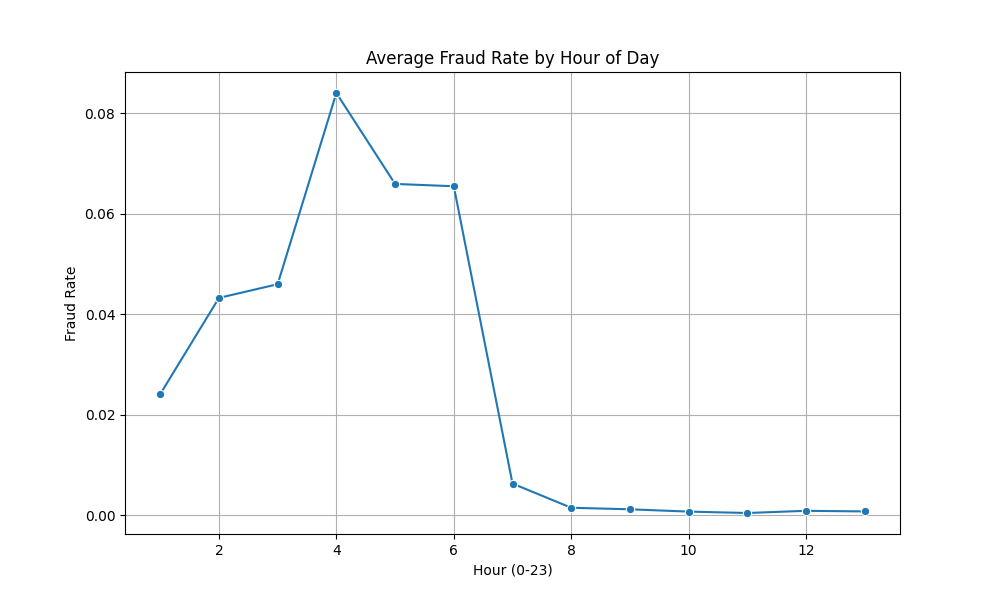

# 🛡️ Fraud Detection on PaySim Dataset

This machine learning project detects **fraudulent mobile money transactions** using the [PaySim dataset](https://www.kaggle.com/datasets/ealaxi/paysim1). 

We build an **XGBoost classifier** trained on a reduced dataset for fast performance and interpret its predictions using **SHAP values**. We also explore **hour-wise trends in fraudulent activity** to gain real-world insights.

---

## 📦 About the Dataset: PaySim

**PaySim** is a synthetic dataset that simulates **real mobile money transactions**, inspired by services like **M-Pesa** in Kenya. It was generated using actual transaction patterns to train and evaluate fraud detection models — **without exposing private user data**.

PaySim is commonly used for:
- Financial fraud detection
- Transaction modeling
- Machine learning education and benchmarking

📄 Dataset Source:  
[PaySim on Kaggle](https://www.kaggle.com/datasets/ealaxi/paysim1)

---

### 🔍 Dataset Columns Explained

| Column Name       | Description |
|-------------------|-------------|
| `step`            | Time step (1 step = 1 hour) |
| `type`            | Type of transaction (`TRANSFER`, `CASH_OUT`, etc.) |
| `amount`          | Amount transferred in the transaction |
| `nameOrig`        | Unique ID of sender |
| `oldbalanceOrg`   | Sender's balance before the transaction |
| `newbalanceOrig`  | Sender's balance after the transaction |
| `nameDest`        | Unique ID of recipient |
| `oldbalanceDest`  | Recipient's balance before the transaction |
| `newbalanceDest`  | Recipient's balance after the transaction |
| `isFraud`         | `1` if transaction is fraudulent, else `0` |
| `isFlaggedFraud`  | `1` if transaction was flagged by an internal rule (amount > 200k), else `0` |

🧠 **Important Note**:  
Fraud cases are very rare in the dataset (~0.1% of total) — making it ideal to test how well machine learning can identify small but dangerous patterns.

---

## 📚 Project Overview

- 📊 **Dataset**: [PaySim Kaggle Dataset](https://www.kaggle.com/datasets/ealaxi/paysim1)  
  Simulates mobile money transactions, including types like TRANSFER, CASH_OUT, etc.

- ⚙️ **Method**:
  1. Load the original dataset (~6M rows)
  2. Randomly sample 100,000 transactions for lightweight training
  3. Filter to only `TRANSFER` and `CASH_OUT` transaction types
  4. Train an **XGBoost model** on processed features
  5. Use **SHAP** to explain model behavior
  6. Plot **fraud frequency by hour** to identify high-risk periods

---

## 🧠 Model Details

- Model: `XGBoostClassifier`
- Dataset size: 100,000 (downsampled)
- Target: `isFraud` column
- Key features: `amount`, `errorOrig`, `errorDest`, time-of-day encoded as sine/cosine

---

## 📊 Results

| Metric               | Value      |
|----------------------|------------|
| Accuracy             | **1.00**   |
| Precision (Fraud)    | 0.38       |
| Recall (Fraud)       | **0.59**   |
| F1-Score (Fraud)     | 0.46       |
| ROC AUC Score        | **0.968** ✅ |

> ✅ Despite a highly imbalanced dataset, the model performs strongly — correctly identifying ~59% of frauds with excellent overall discrimination (ROC AUC ≈ 0.97).

---

## 📈 Visual Results

### 🔹 SHAP Summary Plot

This explains **which features drive the model’s predictions**.  
Higher SHAP value = more influence on predicting fraud.

**Insights**:
- High `amount` increases fraud risk.
- `errorOrig` and `errorDest` indicate balance issues → key fraud signals.
- Time features (`hour_sin`, `hour_cos`) help model identify time-based fraud behavior.

---

### 🔹 Hourly Fraud Trend

This chart shows **average fraud rate by hour of the day**.

**Insights**:
- Fraud spikes sharply between **2 AM and 6 AM**
- Suggests most fraud occurs during low-activity/off-watch hours

---

## 🧪 Technologies Used

- Python 🐍
- pandas, numpy, matplotlib, seaborn
- XGBoost
- scikit-learn
- SHAP (for explainability)

---
